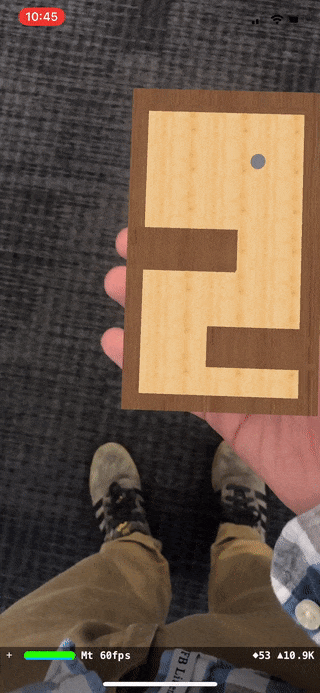

# ARKit-Marble-Labyrinth
Example of making a marble roll around inside of a tracking image.

Feel free to post fixes or updates, I'm planning on expanding this and having it as a simple framework once Xcode-beta has a couple of bugs ironed out.

